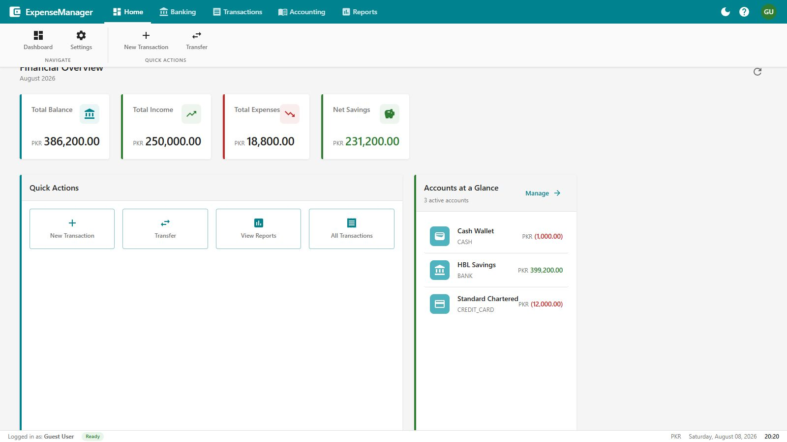
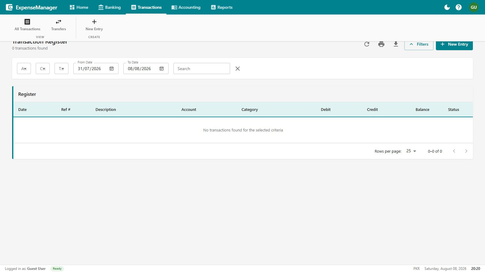
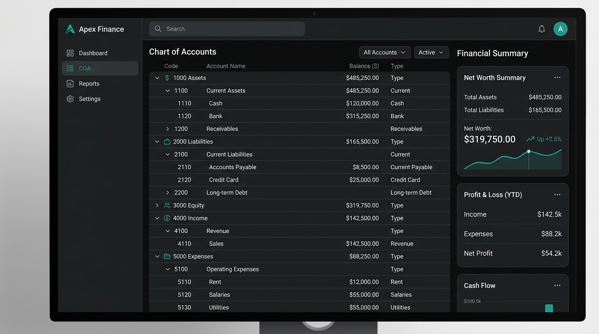
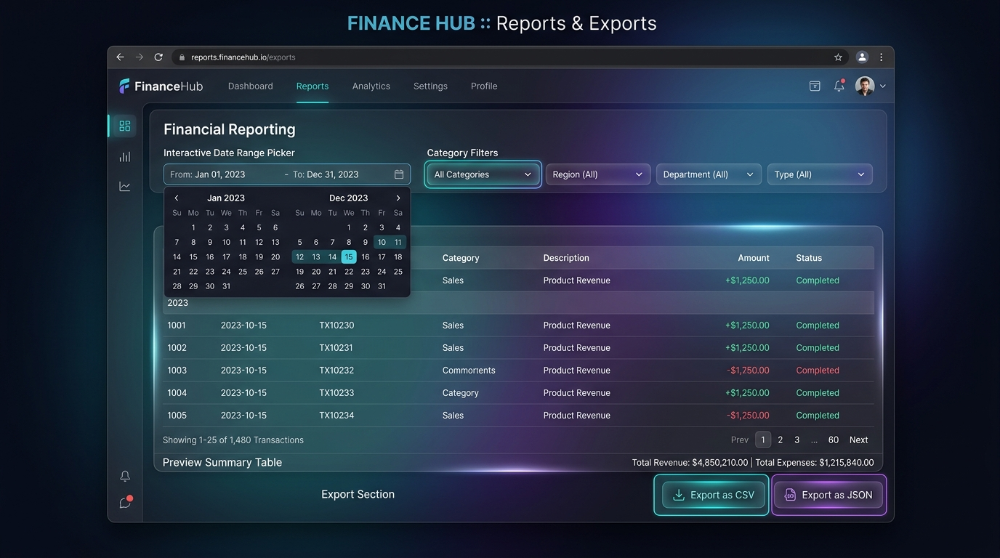
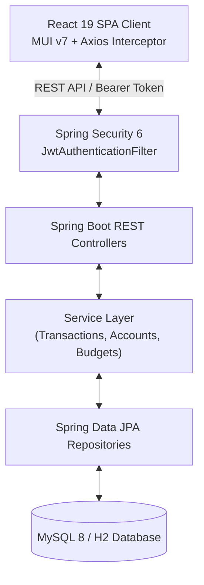

# Expense Management System

> Full-stack personal finance and expense tracking platform built with Spring Boot 3, React 19, Material-UI v7, and MySQL.

---

## 📷 Visual Showcase & Interface Gallery

### Financial Analytics Dashboard


### Transaction Ledger & Double-Leg Transfers


### Double-Entry Chart of Accounts & Net Worth


### Financial Reports & Multi-Format Exports


---

## 💡 Overview & Motivation

Managing personal finances across multiple bank accounts, cash wallets, credit cards, and digital payment channels requires a centralized, transparent ledger. The **Expense Management System** was developed to bridge the gap between simple budget apps and double-entry accounting tools.

It provides users with real-time balance tracking, category-based spending caps, atomic account transfers, double-entry Chart of Accounts analysis, and custom data export capabilities (CSV/JSON).

---

## ✨ Features

- **Multi-Account Financial Tracking**: Manage Bank Accounts, Cash Wallets, Credit Cards, and Mobile Wallets with real-time current balance computation.
- **Transactional Ledger**: Record Income, Expense, and Transfer transactions. Transfers execute as atomic double-leg operations updating both source and destination accounts synchronously.
- **Budget Management**: Define period-based spending limits (Monthly, Weekly, Annual) across categories with visual threshold alerts.
- **Chart of Accounts & General Ledger**: View standard accounting codes (1xxx Assets, 2xxx Liabilities, 4xxx Income, 5xxx Expenses) with real-time Net Worth calculation ($\text{Assets} - \text{Liabilities}$).
- **Interactive Analytics**: Dashboard overview cards, spending breakdown pie charts, and monthly trend bar charts powered by `Chart.js`.
- **CSV/JSON Data Export**: Export filtered transaction records using Apache Commons CSV or JSON schema builders.
- **Receipt Attachments**: Upload and link receipt files (JPEG, PNG, PDF) directly to specific transactions.
- **Recurring Transactions Engine**: Schedule automated recurring rules with interval calculation logic.

---

## 🛠 Tech Stack

### Backend
- **Language**: Java 17
- **Framework**: Spring Boot 3.5.6 (MVC, Security, Data JPA, Actuator)
- **Security**: Spring Security 6 with JJWT (Stateless Bearer Tokens) & BCrypt
- **Database**: MySQL 8.0 (Production) / H2 (In-memory testing)
- **Utilities**: Apache Commons CSV 1.10.0, Lombok, Jakarta Validation API
- **Build Tool**: Apache Maven

### Frontend
- **Framework**: React 19.2.3 (SPA architecture)
- **UI Design System**: Material-UI (MUI v7.3.6) with Emotion (`@emotion/react`)
- **Charts & Visuals**: Chart.js 4.5.1 + `react-chartjs-2`
- **Forms & Validation**: `react-hook-form` + `yup`
- **HTTP Client**: Axios 1.13.2 with JWT Bearer request interceptors
- **Routing**: React Router DOM v7.11.0

---

## 🏗 Architecture Overview



For detailed architectural specifications, system diagrams, and design records, see [`docs/architecture.md`](docs/architecture.md) and [`docs/decisions.md`](docs/decisions.md).

---

## 🚀 Installation & Setup

### Prerequisites
- JDK 17 or higher
- Node.js 18+ and npm
- MySQL Server 8.0+

### 1. Environment Configuration
Copy `.env.example` templates to `.env` for custom local configuration:
```bash
cp .env.example .env
cp expense-system-frontend/.env.example expense-system-frontend/.env
```

### 2. Database Setup
Create MySQL database:
```sql
CREATE DATABASE `expense-system-db`;
```

### 3. Backend Startup
Run Spring Boot backend from project root:
```bash
./mvnw spring-boot:run
```
*The backend starts on `http://localhost:8080` and auto-seeds sample demo data (`guest@example.com` / `guest123`).*

### 4. Frontend Startup
Run React development server:
```bash
cd expense-system-frontend
npm install
npm start
```
*The frontend application opens on `http://localhost:3000`.*

---

## 📖 Usage Guides & Manuals

1. **Quick Start**: Use demo credentials `guest@example.com` / `guest123` or register a new user account.
2. **Account Setup**: Set up initial balances for Bank Accounts, Cash, or Credit Cards under the Accounts view.
3. **Transactions**: Log income or expenses, attach receipt files, or execute transfers between accounts.
4. **Detailed Guides**:
   - [`docs/setup.md`](docs/setup.md) — Comprehensive Setup & Environment Guide
   - [`docs/usage.md`](docs/usage.md) — End-User Operations Manual
   - [`docs/development.md`](docs/development.md) — Developer & Contributor Guide
   - [`docs/api.md`](docs/api.md) — REST API Specification & Endpoint Catalog

---

## 🗺 Roadmap

- [x] Spring Security 6 stateless JWT authentication integration.
- [x] Externalized environment variable configurations (`.env.example`).
- [x] Double-entry Chart of Accounts & General Ledger views.
- [ ] Multi-currency exchange rate conversion service integration.
- [ ] Automated email & push notification alerts for budget cap breaches.
- [ ] Docker Compose orchestration for backend, frontend, and MySQL containers.

---

## 📄 License

Distributed under the MIT License. See [`LICENSE`](LICENSE) for details.
