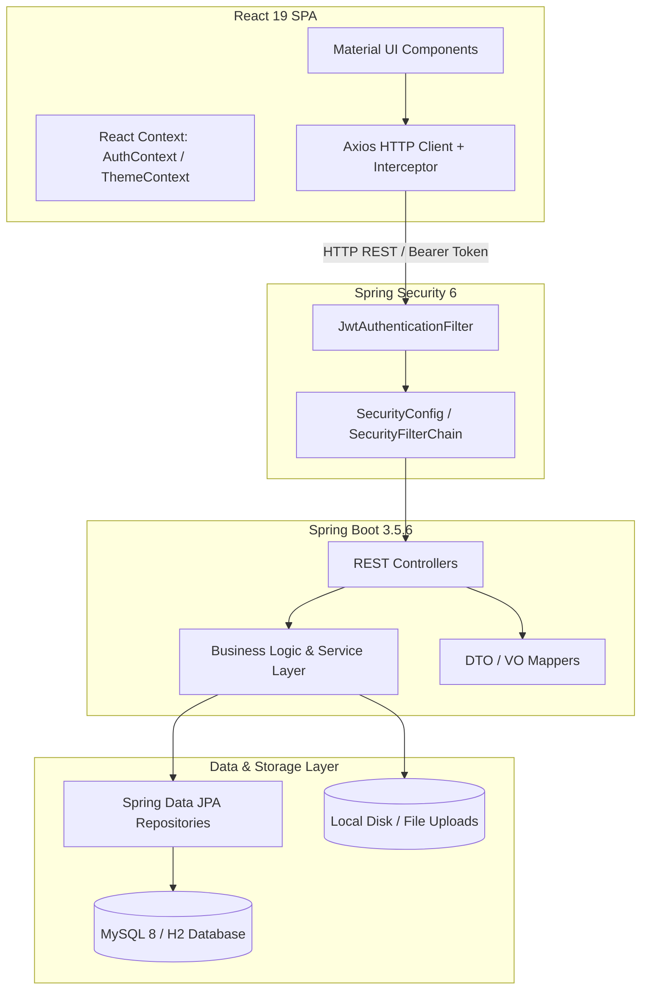
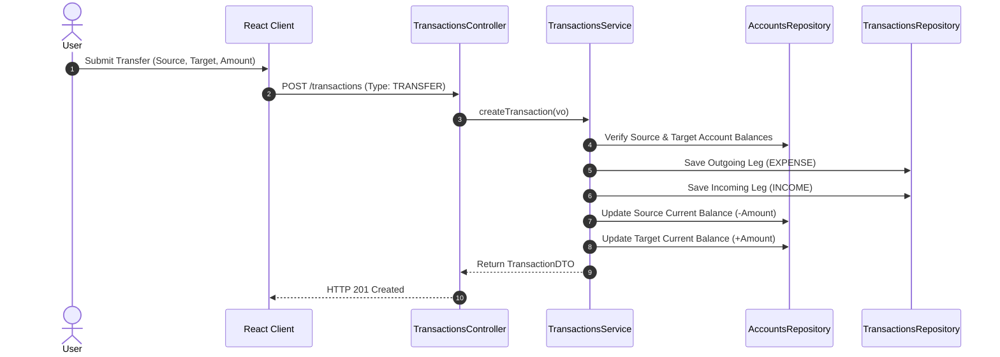

# System Architecture Overview

This document describes the architectural design, system boundaries, data flow, and component organization of the **Expense Management System**.

---

## 1. System Overview & Technology Stack

The application is structured as a decoupled multi-tier system:

- **Frontend Tier**: React 19 Single Page Application (SPA) using Material UI (MUI v7), Chart.js visual analytics, and Axios REST client.
- **Backend Tier**: Java 17 Spring Boot 3.5.6 Web Application providing stateless RESTful APIs.
- **Security Tier**: Spring Security 6 with stateless JWT Bearer token authentication and BCrypt password hashing.
- **Persistence Tier**: Spring Data JPA / Hibernate ORM connected to MySQL 8.0 (production) or H2 (in-memory test).

---

## 2. High-Level Architecture Diagram

---

## 3. Data Flow & Component Interaction

### A. Authentication & Session Setup
1. Client submits credentials to `POST /users/login`.
2. `UsersController` delegates to `UsersService`, validating credentials via BCrypt.
3. Upon success, `JwtUtil` issues a signed JWT token containing `userId` and `email` claims with a 24-hour expiration.
4. Client stores token in `localStorage` via `AuthContext`.
5. Subsequent HTTP requests automatically include `Authorization: Bearer <token>` header added by `axios.js` interceptor.

### B. Double-Leg Transfer Execution

---

## 4. Database Entity Relationships

The core database model consists of user-scoped financial entities:

- **`Users`**: Primary entity owning accounts, budgets, transactions, categories, and settings.
- **`Accounts`**: Financial buckets (`BANK`, `CASH`, `CREDIT_CARD`, `MOBILE_WALLET`) with initial and real-time balances.
- **`Categories`**: Hierarchical classification trees for Income, Expense, and Transfer tagging.
- **`Transactions`**: Atomic units of financial record containing transaction type, amount, status (`CLEARED`, `PENDING`), date, and relationships to `Accounts`, `Categories`, and optional `Merchants`.
- **`Budgets` & `BudgetItems`**: Spending threshold limits associated with specific categories over time windows (Monthly, Weekly, Annual).
- **`Attachments`**: Receipt metadata linking uploaded disk files to specific transactions.
